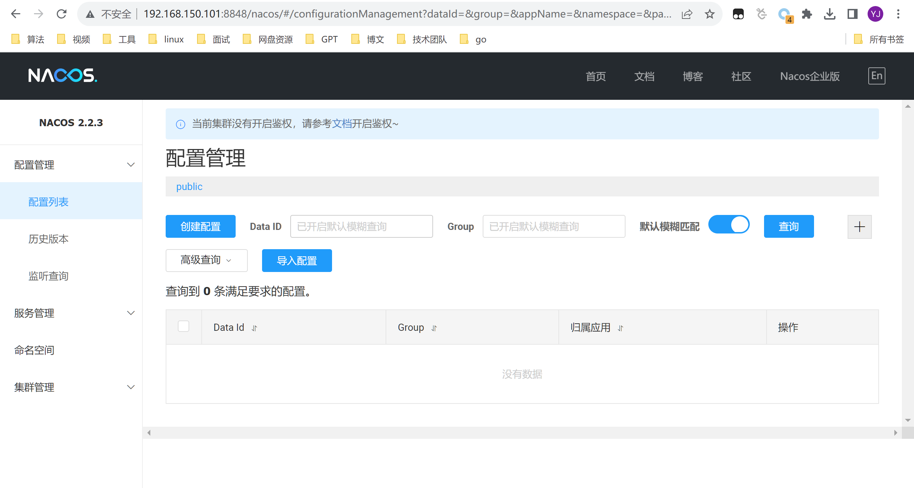
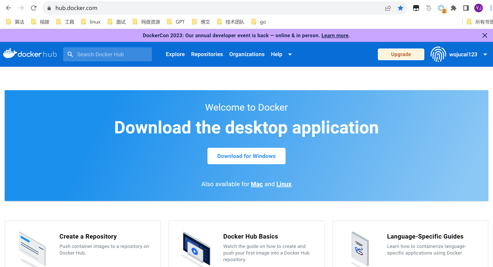
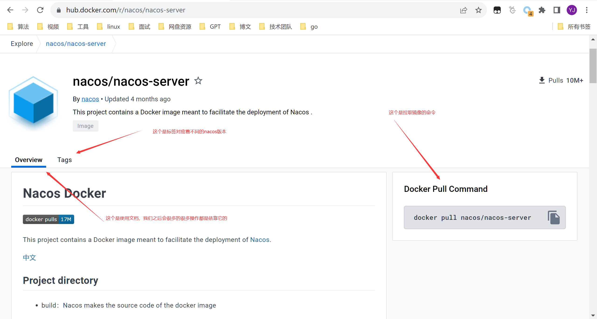

这一节我们来探讨一下软件的安装和启动，在我们之前的学习中，我们可能倾向于去将手动下载，然后解压安装，但是随着技术的迭代，越来越多的虚拟技术的出现使得软件安装部署也有了新的花样。

假如我们来假设这样一个场景，我们需要部署一个集群，这样的话如果是在我们自己测试的环境还好说，通过暴力进行解决，或者说也可以通过写一个shell脚本进行，但是如果说是在不同的主机上，这样就会变得很麻烦，于是乎就有了[Docker](https://zh.wikipedia.org/wiki/Docker),[k8s](https://zh.wikipedia.org/wiki/Kubernetes)等一系列的实现方案，我们可以在虚拟的容器内进行部署，然后也可以动态的进行上线下线的控制。对于Docker的学习还是有一定的必要的，之后可以了解一下这里只是简单的介绍一下之后的软件安装模式。

# 1.5 Nacos的安装和启动

我们这部分还是根据Nacos的官网来进行，有什么需要注意的细节我会一一的点明。

因为Nacos是基于JAVA实现的，所以最基础的要JAVA的环境，这一点是必不可少的，一下的安装都基于Linux完成，原因的话可以下去自己去了解。

## 1.5.1 单机部署启动

我们就从最基础的开始安装，只演示一次，之后我们会只使用docker安装。因为学到这里就已经默认已经具备独立安装JDK的条件了，我们主要来进行安装Nacos。

首先我们要先下载适合我们的软件包，下载地址我们一般是在github上找稳定的版本，我选择的是最新的

[Nacos](https://github.com/alibaba/nacos/releases/download/2.2.3/nacos-server-2.2.3.tar.gz)，选择第一个进行下载。


下载成功后，我们将其上传至Linux中，也可以通过linux的curl命令下载，但是一般很慢不建议。

```bash
#解压
tar -zxvf nacos-server-2.2.3.tar.gz nacos
```

修改配置，nacos的配置是在application.properties中

```properties
#*************** Spring Boot Related Configurations ***************#
#这些一般用默认的就可以
### Default web context path:
server.servlet.contextPath=/nacos
### Include message field
server.error.include-message=ALWAYS
### Default web server port:
server.port=8848

#*************** Network Related Configurations ***************#
### If prefer hostname over ip for Nacos server addresses in cluster.conf:
# nacos.inetutils.prefer-hostname-over-ip=false

### Specify local server's IP:
# nacos.inetutils.ip-address=


#*************** Config Module Related Configurations ***************#
### If use MySQL as datasource:
### Deprecated configuration property, it is recommended to use `spring.sql.init.platform` replaced.
# spring.datasource.platform=mysql
# spring.sql.init.platform=mysql

### Count of DB:
# db.num=1

#数据库的配置，我就用我本机的mysql，也不再进行安装了
db.url.0=jdbc:mysql://10.102.46.60:3306/nacos?characterEncoding=utf8&connectTimeout=1000&socketTimeout=3000&autoReconnect=true&useUnicode=true&useSSL=false&serverTimezone=UTC
db.user.0=root
db.password.0=123456

### Connection pool configuration: hikariCP
db.pool.config.connectionTimeout=30000
db.pool.config.validationTimeout=10000
db.pool.config.maximumPoolSize=20
db.pool.config.minimumIdle=2

#*************** Naming Module Related Configurations ***************#

### If enable data warmup. If set to false, the server would accept request without local data preparation:
# nacos.naming.data.warmup=true

### If enable the instance auto expiration, kind like of health check of instance:
# nacos.naming.expireInstance=true

### Add in 2.0.0
### The interval to clean empty service, unit: milliseconds.
# nacos.naming.clean.empty-service.interval=60000

### The expired time to clean empty service, unit: milliseconds.
# nacos.naming.clean.empty-service.expired-time=60000

### The interval to clean expired metadata, unit: milliseconds.
# nacos.naming.clean.expired-metadata.interval=5000

### The expired time to clean metadata, unit: milliseconds.
# nacos.naming.clean.expired-metadata.expired-time=60000

### The delay time before push task to execute from service changed, unit: milliseconds.
# nacos.naming.push.pushTaskDelay=500

### The timeout for push task execute, unit: milliseconds.
# nacos.naming.push.pushTaskTimeout=5000

### The delay time for retrying failed push task, unit: milliseconds.
# nacos.naming.push.pushTaskRetryDelay=1000

### Since 2.0.3
### The expired time for inactive client, unit: milliseconds.
# nacos.naming.client.expired.time=180000

#*************** CMDB Module Related Configurations ***************#
### The interval to dump external CMDB in seconds:
# nacos.cmdb.dumpTaskInterval=3600

### The interval of polling data change event in seconds:
# nacos.cmdb.eventTaskInterval=10

### The interval of loading labels in seconds:
# nacos.cmdb.labelTaskInterval=300

### If turn on data loading task:
# nacos.cmdb.loadDataAtStart=false


#*************** Metrics Related Configurations ***************#
### Metrics for prometheus
#management.endpoints.web.exposure.include=*

### Metrics for elastic search
management.metrics.export.elastic.enabled=false
#management.metrics.export.elastic.host=http://localhost:9200

### Metrics for influx
management.metrics.export.influx.enabled=false
#management.metrics.export.influx.db=springboot
#management.metrics.export.influx.uri=http://localhost:8086
#management.metrics.export.influx.auto-create-db=true
#management.metrics.export.influx.consistency=one
#management.metrics.export.influx.compressed=true

#*************** Access Log Related Configurations ***************#
### If turn on the access log:
server.tomcat.accesslog.enabled=true

### The access log pattern:
server.tomcat.accesslog.pattern=%h %l %u %t "%r" %s %b %D %{User-Agent}i %{Request-Source}i

### The directory of access log:
server.tomcat.basedir=file:.

#*************** Access Control Related Configurations ***************#
### If enable spring security, this option is deprecated in 1.2.0:
#spring.security.enabled=false

### The ignore urls of auth
nacos.security.ignore.urls=/,/error,/**/*.css,/**/*.js,/**/*.html,/**/*.map,/**/*.svg,/**/*.png,/**/*.ico,/console-ui/public/**,/v1/auth/**,/v1/console/health/**,/actuator/**,/v1/console/server/**

### The auth system to use, currently only 'nacos' and 'ldap' is supported:
nacos.core.auth.system.type=nacos

### If turn on auth system:
nacos.core.auth.enabled=false

### Turn on/off caching of auth information. By turning on this switch, the update of auth information would have a 15 seconds delay.
nacos.core.auth.caching.enabled=true

### Since 1.4.1, Turn on/off white auth for user-agent: nacos-server, only for upgrade from old version.
nacos.core.auth.enable.userAgentAuthWhite=false

### Since 1.4.1, worked when nacos.core.auth.enabled=true and nacos.core.auth.enable.userAgentAuthWhite=false.
### The two properties is the white list for auth and used by identity the request from other server.
nacos.core.auth.server.identity.key=
nacos.core.auth.server.identity.value=

### worked when nacos.core.auth.system.type=nacos
### The token expiration in seconds:
nacos.core.auth.plugin.nacos.token.cache.enable=false
nacos.core.auth.plugin.nacos.token.expire.seconds=18000
### The default token (Base64 String):
nacos.core.auth.plugin.nacos.token.secret.key=

### worked when nacos.core.auth.system.type=ldap，{0} is Placeholder,replace login username
#nacos.core.auth.ldap.url=ldap://localhost:389
#nacos.core.auth.ldap.basedc=dc=example,dc=org
#nacos.core.auth.ldap.userDn=cn=admin,${nacos.core.auth.ldap.basedc}
#nacos.core.auth.ldap.password=admin
#nacos.core.auth.ldap.userdn=cn={0},dc=example,dc=org
#nacos.core.auth.ldap.filter.prefix=uid
#nacos.core.auth.ldap.case.sensitive=true


#*************** Istio Related Configurations ***************#
### If turn on the MCP server:
nacos.istio.mcp.server.enabled=false

#*************** Core Related Configurations ***************#

### set the WorkerID manually
# nacos.core.snowflake.worker-id=

### Member-MetaData
# nacos.core.member.meta.site=
# nacos.core.member.meta.adweight=
# nacos.core.member.meta.weight=

### MemberLookup
### Addressing pattern category, If set, the priority is highest
# nacos.core.member.lookup.type=[file,address-server]
## Set the cluster list with a configuration file or command-line argument
# nacos.member.list=192.168.16.101:8847?raft_port=8807,192.168.16.101?raft_port=8808,192.168.16.101:8849?raft_port=8809
## for AddressServerMemberLookup
# Maximum number of retries to query the address server upon initialization
# nacos.core.address-server.retry=5
## Server domain name address of [address-server] mode
# address.server.domain=jmenv.tbsite.net
## Server port of [address-server] mode
# address.server.port=8080
## Request address of [address-server] mode
# address.server.url=/nacos/serverlist

#*************** JRaft Related Configurations ***************#

### Sets the Raft cluster election timeout, default value is 5 second
# nacos.core.protocol.raft.data.election_timeout_ms=5000
### Sets the amount of time the Raft snapshot will execute periodically, default is 30 minute
# nacos.core.protocol.raft.data.snapshot_interval_secs=30
### raft internal worker threads
# nacos.core.protocol.raft.data.core_thread_num=8
### Number of threads required for raft business request processing
# nacos.core.protocol.raft.data.cli_service_thread_num=4
### raft linear read strategy. Safe linear reads are used by default, that is, the Leader tenure is confirmed by heartbeat
# nacos.core.protocol.raft.data.read_index_type=ReadOnlySafe
### rpc request timeout, default 5 seconds
# nacos.core.protocol.raft.data.rpc_request_timeout_ms=5000

#*************** Distro Related Configurations ***************#

### Distro data sync delay time, when sync task delayed, task will be merged for same data key. Default 1 second.
# nacos.core.protocol.distro.data.sync.delayMs=1000

### Distro data sync timeout for one sync data, default 3 seconds.
# nacos.core.protocol.distro.data.sync.timeoutMs=3000

### Distro data sync retry delay time when sync data failed or timeout, same behavior with delayMs, default 3 seconds.
# nacos.core.protocol.distro.data.sync.retryDelayMs=3000

### Distro data verify interval time, verify synced data whether expired for a interval. Default 5 seconds.
# nacos.core.protocol.distro.data.verify.intervalMs=5000

### Distro data verify timeout for one verify, default 3 seconds.
# nacos.core.protocol.distro.data.verify.timeoutMs=3000

### 加载快照数据失败时，分区数据加载重试的延迟时间，默认为 30 秒。
# nacos.core.protocol.distro.data.load.retryDelayMs=30000

### 启用以支持 prometheus 服务发现
#nacos.prometheus.metrics.enabled=true

### Since 2.3
#*************** Grpc Configurations ***************#

## sdk grpc(between nacos server and client) configuration
## Sets the maximum message size allowed to be received on the server.
#nacos.remote.server.grpc.sdk.max-inbound-message-size=10485760

## 设置发送 keepalive ping 之前无读取活动的时间（毫秒）。典型的默认值是两小时。
#nacos.remote.server.grpc.sdk.keep-alive-time=7200000

## 设置发送 keepalive ping 后等待读取活动的时间（毫秒）。默认为 20 秒。
#nacos.remote.server.grpc.sdk.keep-alive-timeout=20000


## 设置时间（毫秒），指定允许客户端配置的最长保持连接时间。典型的默认值是 5 分钟
#nacos.remote.server.grpc.sdk.permit-keep-alive-time=300000

## cluster grpc(inside the nacos server) configuration
#nacos.remote.server.grpc.cluster.max-inbound-message-size=10485760

## 设置发送 keepalive ping 之前无读取活动的时间（毫秒）。典型的默认值是两小时。
#nacos.remote.server.grpc.cluster.keep-alive-time=7200000

## 设置发送 keepalive ping 后等待读取活动的时间（毫秒）。默认为 20 秒。
#nacos.remote.server.grpc.cluster.keep-alive-timeout=20000

## 设置时间（毫秒），指定允许客户端配置的最长保持连接时间。典型的默认值是 5 分钟
#nacos.remote.server.grpc.cluster.permit-keep-alive-time=300000

```

我们一开始仅需关注权限认证和数据库配置的配置文件即可，后续的参数配置在使用时再进行探讨。接下来我们来进行启动nacos。我们先不开启认证，先进行体验，后续再进行开启认证。

如果启动过程中出现libstdc++.so.6: cannot open shared object file: No such file or directory，大概是共享库有所缺失，我们可以通过一位网友的做法来进行解决。[解决方案](https://blog.csdn.net/shenxiaomo1688/article/details/104689237/)

```bash
sh startup.sh -m standalone
```


启动成功，然后我们进行访问。



此时我们可以先自己进行稍微体验一下，再然后我们将开始docker部署。

## 1.5.2 docker部署启动

如果你学习过docker的话就会大概知道我们要安装一个应用的话需要先下载镜像，然后通过镜像来进行容器的获取。[dockerhub](https://hub.docker.com/)是一个可以下载镜像的网站，当然国内也有自己的镜像，你也可以选择自己搭一个镜像托管的网站或是自己写一个镜像(不推荐，毕竟前人已经实现了)，由于官网经常不能用，所以我们采用代理的方式来解决，

[dockerproxy](https://dockerproxy.com/),目前来说做的最好的集成代理。

当然国内也有响应的镜像，[阿里云](https://promotion.aliyun.com/ntms/act/kubernetes.html)、[网易云](https://c.163yun.com/hub#/home)，我们先要进行搜索nacos的镜像，然后安装。

我们首先进入dockerhub的官方网站，然后去搜索我们要的镜像，一般来说，对于开源的软件都有已经构建好的镜像，我们不需要自己再去构建。



然后我们来搜索nacos


第一个就是我们需要的应用软件。

我们先去Tags中找到我们需要的版本往下看文档我们就会看到对应的启动命令，这里还是推荐先去大概的了解docker再来进行下面的安装步骤。

```bash
# 拉取镜像命令
docker pull nacos/nacos-server:v2.2.3

# 启动命令,因为在2.x版本后开启了grpc，所以我们还要开启9849端口
#1、不配置数据库的启动
docker run --name nacos-test1 -e MODE=standalone -p 8848:8848 -d nacos/nacos-server:v2.2.3
# 注意要运行sql文件，没有sql数据库会报错
#2、配置数据库
docker run \
--name nacos-test2 \
-e MODE=standalone \
-e SPRING_DATASOURCE_PLATFORM=mysql \
-e MYSQL_SERVICE_HOST=10\.102\.46\.60 \
-e MYSQL_SERVICE_DB_NAME=nacos \
-e MYSQL_SERVICE_USER=root \
-e MYSQL_SERVICE_PASSWORD=123456 \
-e MYSQL_SERVICE_DB_PARAM=characterEncoding=utf8\&connectTimeout=1000\&socketTimeout=3000\&autoReconnect=true\&useSSL=false \
-p 8848:8848 \
-p 9848:9848 \
-d nacos/nacos-server:v2.2.3
```


我们可以根据文档的下面的参数表格来书写我们想要的配置项，也可以执行docker命令进入容器内部进行修改，我比较推荐前者。

还有更方便的安装方式docker-compose,这里就不进行过多的阐述，读者可以下去自行了解，总的来说docker的功能十分强大，它还支持内部的分配ip和网段进行网络的划分，有必要去好好的学习一下，这里我推荐一下自己的入门书籍[《Docker 一从入门到实践》](https://yeasy.gitbook.io/docker_practice/)，今天的介绍就到此为止。

