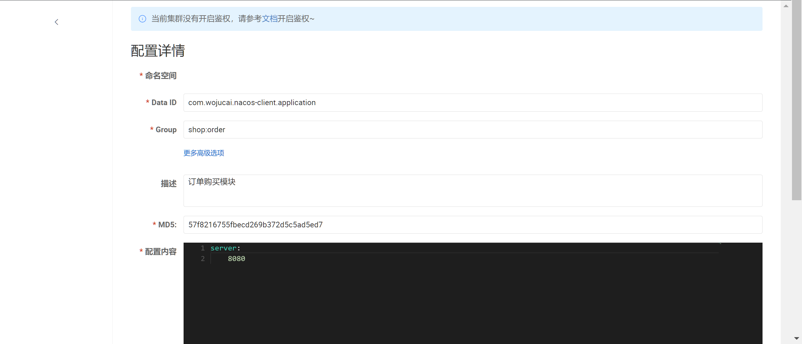
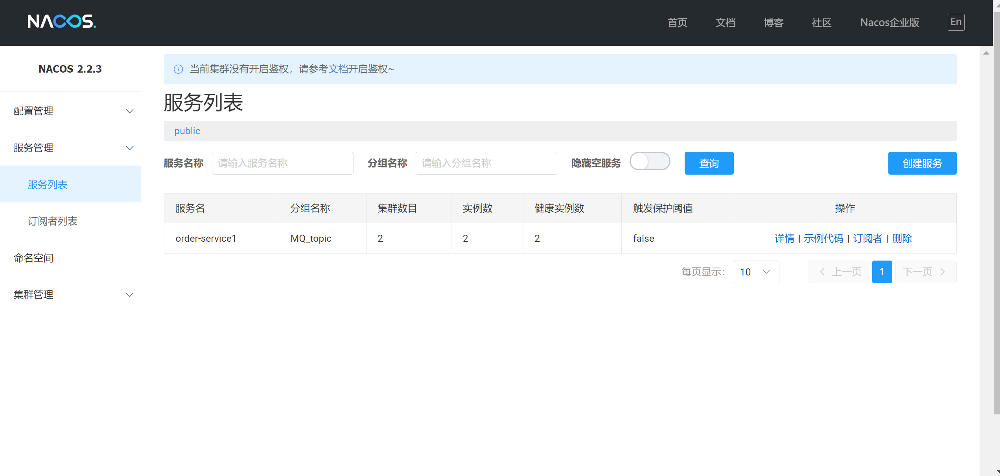

上一章我们大概了解了nacos的一些特性和基础的安装配置，下来我们将对于nacos的使用来进行讲解，对于我们来说一门技术的使用要么是对外进行提供SDK，要么是直接提供通信接口，最后便是与各种开发框架进行集成，nacos也不例外，他有着自己的client，也有和各种开源框架的集成。

我们的开发环境选择的IDEA，采用的nacos的版本为v2.2.3，因为我是根据nacos的官网开始的，所以我们可以跟随官网的例子，将步骤走一下，来领略下nacos的强大，以下的学习我们来通过[nacos-example](https://github.com/nacos-group/nacos-examples)来进行学习和体验。

**注意JAVA的版本最好使用1.8，不然可能会出现一系列的错误。**

# 2.1 NacosClient

首先是我们需要引入nacos-client，这个是客户端SDK，我们需要导入maven坐标，我们采用JUNIT4来进行测试功能。

```xml
 <properties>
        <!-- 2.2.3版本以上支持纯净版客户端 -->
        <nacos.version>2.2.3</nacos.version>
</properties>

<dependencies>
    <dependency>
        <!--这里我们就不采用纯净版的了-->
        <groupId>com.alibaba.nacos</groupId>
        <artifactId>nacos-client</artifactId>
        <version>${nacos.version}</version>
    </dependency>
</dependencies>
```

根据文档来看，我们在使用的时候需要先获取ConfigService，所以我们首先进行获取这个类，我们把它放在初始化的代码中，这样我们就可以在每一次启动的时候获取到ConfigService。**我们首先需要创建dataId和groupId**，如果有需要的话我们还可以新建一个namespace，主要用于配置文件的分组和隔离。

dataId一般是填写包名，保证配置文件的唯一性。

group一般是写产品名:模块名,为了区分不同模块的配置文件。

namespace一般是为了区分的不同的产品，也就是我们所说的项目。

下面是我创建的我自己的配置命名。



```JAVA
 @Before
    public void init() throws NacosException {
        // nacos获取配置
        String serverAddr = "192.168.150.101:8848";
        Properties properties = new Properties();
        properties.put(PropertyKeyConst.SERVER_ADDR, serverAddr);
        configService = NacosFactory.createConfigService(properties);
    }
```

然后我们在使用完毕的时候再进行关闭。

```java
    @After
    public void after() throws NacosException {
        configService.shutDown();
    }
```

然后我们来进行测试功能，各项功能皆是根据文档来的，所以我们就直接统一的贴上代码，也没有什么需要其他的注意的点，需要注意的我们会在这一章的最后一节进行统一解释。

```java
package org.example;

import com.alibaba.nacos.api.NacosFactory;
import com.alibaba.nacos.api.PropertyKeyConst;
import com.alibaba.nacos.api.config.ConfigService;
import com.alibaba.nacos.api.config.listener.Listener;
import com.alibaba.nacos.api.exception.NacosException;
import org.junit.After;
import org.junit.Before;
import org.junit.Test;

import java.util.Properties;
import java.util.concurrent.Executor;

/**
 * @description: 测试nacos
 * @author: xuyujie
 * @date: 2023/09/24
 **/
public class TestNacosConfig {


    ConfigService configService;

    String dataId = "com.wojucai.nacos-client.application";
    String group = "shop:order";
    long timeout = 3000;

    @Before
    public void init() throws NacosException {
        // nacos获取配置
        String serverAddr = "192.168.150.101:8848";
        Properties properties = new Properties();
        properties.put(PropertyKeyConst.SERVER_ADDR, serverAddr);
        // 账号密码,配置auth后启用，后面会介绍
//         properties.put(PropertyKeyConst.USERNAME, "nacos");
//         properties.put(PropertyKeyConst.PASSWORD, "nacos");
        // 命名空间
        //properties.put(PropertyKeyConst.NAMESPACE, "ccf91393-bf70-43ad-aa38-545d7df4a358");
        configService = NacosFactory.createConfigService(properties);
    }

    @After
    public void after() throws NacosException {
        configService.shutDown();
    }

    /**
     * 测试发布
     *  用于通过程序自动发布 Nacos 配置，以便通过自动化手段降低运维成本。
     * 当配置不存在时会创建配置，当配置已存在时会更新配置。
     *
     */
    @Test
    public void testPublishConfig() throws NacosException {
//        dataId = "com.wojucai.nacos-client.application2";
//        group = "shop:order2";
        boolean yaml = configService.publishConfig(dataId, group, "server:\n" +
                "       8081", "yaml");
        System.out.println(yaml);
    }

    @Test
    public void testUpdateConfig() throws NacosException {
        boolean yaml = configService.publishConfig(dataId, group, "server:\n" +
                "       8083", "yaml");
        System.out.println(yaml);
    }

    /**
     * dataId	string	配置 ID，采用类似 package.class（如com.taobao.tc.refund.log.level）的命名规则保证全局唯一性
     * group	string	配置分组，建议填写产品名:模块名（Nacos:Test）保证唯一性，只允许英文字符和4种特殊字符（"."、":"、"-"、"_"），不超过128字节。
     * timeout	long	读取配置超时时间，单位 ms，推荐值 3000。
     * @throws NacosException
     */
    @Test
    public void testGetConfig() throws NacosException {
        String config = configService.getConfig(dataId, group, timeout);
        System.out.println(config);
    }

    /**
     * dataId
     * string
     * 配置 ID，采用类似 package.class（如com.taobao.tc.refund.log.level）的命名规则保证全局唯一性，class 部分建议是配置的业务含义。
     * group
     * string
     * 配置分组，建议填写产品名：模块名（如 Nacos:Test）保证唯一性。
     * listener
     * Listener
     * 监听器，配置变更进入监听器的回调函数。
     */
    @Test
    public void testAddListener() throws NacosException {
        configService.addListener(dataId, group, new Listener() {
            @Override
            public Executor getExecutor() {
                return null;
            }

            @Override
            public void receiveConfigInfo(String s) {
                System.out.println(s);
            }
        });
        // 移除监听器
//        configService.removeListener(dataId, group, new Listener() {
//            @Override
//            public Executor getExecutor() {
//                return null;
//            }
//
//            @Override
//            public void receiveConfigInfo(String s) {
//                System.out.println(s);
//            }
//        });
        // 守护线程
        while (true) {
            try {
                Thread.sleep(1000);
            } catch (InterruptedException e) {
                e.printStackTrace();
            }
        }
        // 取消监听
    }


    /**
     * 用于通过程序自动删除 Nacos 配置
     */
    @Test
    public void testRemoveConfig() throws NacosException {
        boolean removeConfig = configService.removeConfig(dataId, group);
        System.out.println(removeConfig);
    }
}
```

上面是一些基本的和配置文件相关的使用，下面我们来看一下服务发现注册的api。

这里有几个比较重要的实例对象Cluster、Instance和Service。

我们先来看Cluster

```java
public class Cluster implements Serializable {
    /**
    * 序列化ID
    */
    private static final long serialVersionUID = -7196138840047197271L;
    
    /**
     * 属于的服务的名字
     */
    private String serviceName;
    
    /**
     * 集群名
     */
    private String name;
    
    /**
     * 集群的健康检查
     */
    private AbstractHealthChecker healthChecker = new Tcp();
    
    /**
     *	在集群中注册的默认端口号
     */
    private int defaultPort = 80;
    
    /**
     *在集群中默认健康检查的端口
     */
    private int defaultCheckPort = 80;
    
    /**
     * 是否使用实例的端口坐健康检查
     */
    private boolean useIPPort4Check = true;
    /**
    * 元数据
    */
    private Map<String, String> metadata = new HashMap<>();
}
```

然后我们再来看一下Instance

```java
public class Instance implements Serializable {
    
    private static final long serialVersionUID = -742906310567291979L;
    
    /**
     * 实例ID
     */
    private String instanceId;
    
    /**
     * 实例的IP
     */
    private String ip;
    
    /**
     * 实例的端口号
     */
    private int port;
    
    /**
     *	实例的权重
     */
    private double weight = 1.0D;
    
    /**
     * 实例的健康状态
     */
    private boolean healthy = true;
    
    /**
     * 实例是否接收请求
     */
    private boolean enabled = true;
    
    /**
     * 是否是短暂的实例
     *
     * @since 1.0.0
     */
    private boolean ephemeral = true;
    
    /**
     * 实例的集群名
     */
    private String clusterName;
    
    /**
     * 实例的服务名
     */
    private String serviceName;
    
    /**
     * 元数据
     */
    private Map<String, String> metadata = new HashMap<>();
}
```

然后我们来看一下Service这个类

```java
/**
 * 我们引入了一个 "服务-->集群-->实例 "模型，
 * 其中服务存储了一个集群列表，而集群则包含一个实例列表。
 */
public class Service implements Serializable {
    
    private static final long serialVersionUID = -3470985546826874460L;
    
    /**
     * 服务名
     */
    private String name;
    
    /**
     * 保护阈值
     */
    private float protectThreshold = 0.0F;
    
    /**
     * 这个服务的应用名
     */
    private String appName;
    
    /**
     * 服务分组名，用于将服务分为不同的组。
     */
    private String groupName;
    /**
    * 元数据
    */
    private Map<String, String> metadata = new HashMap<>();
}
```

我们先来注册一个服务，然后注册集群，然后注册群组，来体验一下不同的api。

然后就是我们测试的全部代码

```java
/**
 * @description:测试nacos服务
 * @author: xuyujie
 * @date: 2023/09/24
 **/
public class TestNacosService {

    NamingService namingService;

    NamingMaintainService maintainService;

    String appName = "shop";

    String serviceName = "order-service";

    String groupName = "MQ_topic";


    @Before
    public void init() throws NacosException {
        String serverAddr = "192.168.150.101:8848";
        Properties properties = new Properties();
        properties.put(PropertyKeyConst.SERVER_ADDR, serverAddr);
//        properties.put(PropertyKeyConst.USERNAME, "nacos");
//        properties.put(PropertyKeyConst.PASSWORD, "nacos");
//        properties.put(PropertyKeyConst.NAMESPACE, "ccf91393-bf70-43ad-aa38-545d7df4a358");
        namingService = NacosFactory.createNamingService(properties);
        maintainService = NacosFactory.createMaintainService(properties);
    }

    /**
     * 创建服务
     */
    @Test
    public void testRegisterInstance2() throws NacosException {
        // 注册服务
        Service service = new Service();
        service.setAppName(appName);
        service.setName(serviceName);
        service.setGroupName(groupName);
        service.setProtectThreshold(1);
        Map<String, String> serviceMetadata = new HashMap<>();
        service.setMetadata(serviceMetadata);
		maintainService.createService(service, new NoneSelector());
		Service service1 = maintainService.queryService("order-service", "MQ_topic");        	  System.out.println(service1);
        // 保证服务是在线状态
        while (true) {

        }
    }

    /**
     * 创建集群
     */
    @Test
    public void testRegisterCluster() throws NacosException {
        Map<String, String> serviceMetadata = new HashMap<>();
        // 注册实例到集群
        namingService.registerInstance(serviceName+1,groupName,"11.11.11.11",80, "order-service-cluster");
        // 保证服务是在线状态
        while (true) {

        }
    }

    /**
     * 注册实例
     */
    @Test
    public void testRegisterInstance() throws NacosException {
        Map<String, String> serviceMetadata = new HashMap<>();
        // 注册实例到集群
        namingService.registerInstance(serviceName+1,groupName,"11.11.11.11",80);
        // 保证服务是在线状态
        while (true) {

        }
    }
}

```

要注意在注册的时候要保证线程是存活状态，只有线程存活，对应的nacos上的实例才会存活。如我现在启动两个线程，对应的nacos是如下图。



当我把服务关闭时，又会变成下图


以上便是我们这节测试它的一些Client功能。


