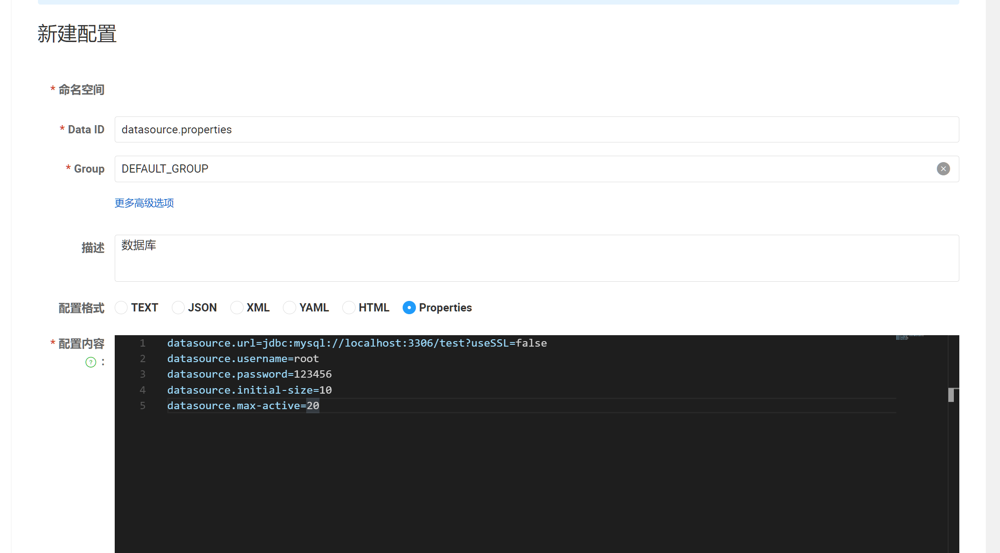
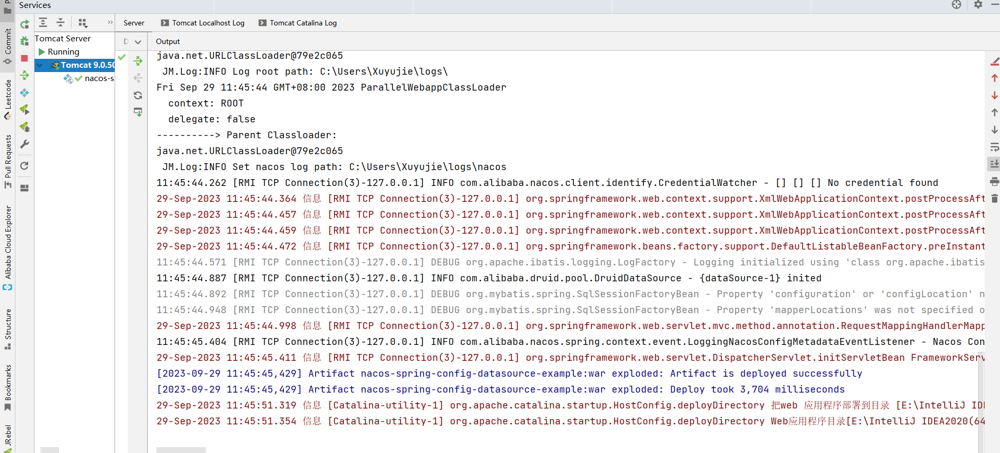

# 2.2 Nacos集成Spring

下面我将对于nacos集成Spring来做进一步的学习，我们来进行参照Nacos官方给的example来继续学习。

## 2.2.1Nacos配置数据库

这个项目是nacos-spring-example的一个子项目，主要用于使用nacos来配置数据库，在WEB-INF文件夹下也有所有的配置文件，这是spring-web的基本的配置文件，我们大概来一个个了解下


首先是datasource.xml，主要用于配置和数据库相关的属性。

```xml
<?xml version="1.0" encoding="UTF-8"?>
<beans xmlns="http://www.springframework.org/schema/beans"
       xmlns:xsi="http://www.w3.org/2001/XMLSchema-instance"
       xmlns:tx="http://www.springframework.org/schema/tx"
       xsi:schemaLocation="http://www.springframework.org/schema/tx http://www.springframework.org/schema/tx/spring-tx.xsd
       http://www.springframework.org/schema/beans http://www.springframework.org/schema/beans/spring-beans.xsd">
	
    <!--配置数据源和线程池-->
    <bean id="dataSource" class="com.alibaba.druid.pool.DruidDataSource"
          init-method="init" destroy-method="close">
        <property name="url" value="${datasource.url}"/>
        <property name="username" value="${datasource.username}"/>
        <property name="password" value="${datasource.password}"/>
        <property name="initialSize" value="${datasource.initial-size}"/>
        <property name="maxActive" value="${datasource.max-active}"/>
    </bean>
	
    <!-- 配置事务管理器-->
    <bean id="txManager"
          class="org.springframework.jdbc.datasource.DataSourceTransactionManager">
        <property name="dataSource" ref="dataSource"/>
    </bean>
	<!--事务注解的驱动-->
    <tx:annotation-driven transaction-manager="txManager"/>
</beans>

```

然后是dispatcher-servlet.xml

```xml
<?xml version="1.0" encoding="UTF-8"?>
<beans xmlns:xsi="http://www.w3.org/2001/XMLSchema-instance"
       xmlns:context="http://www.springframework.org/schema/context"
       xmlns:mvc="http://www.springframework.org/schema/mvc"
       xmlns="http://www.springframework.org/schema/beans"
       xsi:schemaLocation="http://www.springframework.org/schema/beans
       http://www.springframework.org/schema/beans/spring-beans.xsd
       http://www.springframework.org/schema/context
       http://www.springframework.org/schema/context/spring-context.xsd
       http://www.springframework.org/schema/mvc
       http://www.springframework.org/schema/mvc/spring-mvc.xsd">
	
    <!-- 开启Spring mvc 的一系列配置视图转发， json序列化等等 -->
    <mvc:annotation-driven/>
	
    <!-- 自动的声明一些上下文注解, 像@Autowired -->
    <context:annotation-config/>
	
    <!-- 配置组件扫描的路径 -->
    <context:component-scan base-package="com.alibaba.nacos.example.spring"/>
	<!-- 导入其他的配置文件 -->
    <import resource="nacos.xml"/>
    <import resource="datasource.xml"/>
    <import resource="spring-config-mybatis.xml"/>
</beans>

```

再然后是nacos.xml

```xml
<?xml version="1.0" encoding="UTF-8"?>
<beans xmlns:xsi="http://www.w3.org/2001/XMLSchema-instance"
       xmlns="http://www.springframework.org/schema/beans"
       xmlns:nacos="http://nacos.io/schema/nacos"
       xsi:schemaLocation="http://www.springframework.org/schema/beans
       http://www.springframework.org/schema/beans/spring-beans.xsd
       http://nacos.io/schema/nacos
       http://nacos.io/schema/nacos.xsd">
	
    <!-- 开启nacos的注解驱动 -->
    <nacos:annotation-driven/>
	<!-- 配置nacos的服务地址,这里没有详细的配置一些组和命名空间。这里还可以再进行拓展-->
    <nacos:global-properties server-addr="127.0.0.1:8848" />

    <!--
        Nacos 控制台添加配置：
        Data ID：
            datasource.properties
        Group：
            DEFAULT_GROUP
        配置内容示例：
            datasource.url=jdbc:mysql://localhost:3306/test?useSSL=false
            datasource.username=root
            datasource.password=root
            datasource.initial-size=10
            datasource.max-active=20
    -->
    <!-- 配置数据源 -->
    <nacos:property-source data-id="datasource.properties"/>
</beans>
```

spring-config-mybatis.xml

```xml
<?xml version="1.0" encoding="UTF-8"?>
<beans xmlns="http://www.springframework.org/schema/beans"
       xmlns:xsi="http://www.w3.org/2001/XMLSchema-instance"
       xsi:schemaLocation="http://www.springframework.org/schema/beans http://www.springframework.org/schema/beans/spring-beans.xsd">
	
    <!-- 配置mybatis的数据源 -->
    <bean class="org.mybatis.spring.SqlSessionFactoryBean"
          id="sqlSessionFactory">
        <property name="dataSource" ref="dataSource"/>
    </bean>
	
    <!-- 配置mybatis -->
    <bean class="org.mybatis.spring.mapper.MapperFactoryBean"
          id="userMapper">
        <property name="sqlSessionFactory" ref="sqlSessionFactory"/>
        <property name="mapperInterface" value="com.alibaba.nacos.example.spring.dao.UserMapper"/>
    </bean>
</beans>
```

web.xml

```xml
<?xml version="1.0" encoding="UTF-8"?>
<web-app xmlns:xsi="http://www.w3.org/2001/XMLSchema-instance" xmlns="http://java.sun.com/xml/ns/javaee"
         xsi:schemaLocation="http://java.sun.com/xml/ns/javaee http://java.sun.com/xml/ns/javaee/web-app_3_0.xsd"
         metadata-complete="true" version="3.0">
  <!-- 配置视图转发 -->
  <servlet>
    <servlet-name>dispatcher</servlet-name>
    <servlet-class>org.springframework.web.servlet.DispatcherServlet</servlet-class>
    <load-on-startup>1</load-on-startup>
  </servlet>

  <servlet-mapping>
    <servlet-name>dispatcher</servlet-name>
    <url-pattern>/</url-pattern>
  </servlet-mapping>

</web-app>
```

如果我们不配置直接进行启动就会报错，如下图：


按照提示我们需要在控制台添加配置,我们添加下配置，然后来看效果。



启动成功，说明我们的应用已经从nacos上拉取下来了配置文件。



查询到了数据库中的值。


以上便是Spring和nacos集成实现的最基本的拉取配置的实例。

## 2.2.2Spring配置注发布到Nacos

Spring的应用程序本身也是向外提供服务的，所以它也可以作为一个实例将配置文件发布到到nacos中，供其他应用程序进行调用。接下来我们要接触的实例是nacos-spring-config-example。

配置文件基本和上一部分无异，我们主要关注如何把这个服务给注册到Nacos中。

奥妙就在于NacosConfiguration这个类，我们需要通过这个类来向nacos发布配置。

```java
// 保证这个类为Spring的配置类， 可以被Spring管理。
@Configuration
// nacos的服务器的一系列配置项
@EnableNacosConfig(globalProperties = @NacosProperties(serverAddr = "192.168.150.101:8848"))
/**
 * Document: https://nacos.io/zh-cn/docs/quick-start-spring.html
 * <p>
 * Nacos 控制台添加配置：
 * <p>
 * Data ID：example
 * <p>
 * Group：DEFAULT_GROUP
 * <p>
 * 配置内容：useLocalCache=true
 */
// 配置属性所属的数据源
@NacosPropertySource(dataId = "example", autoRefreshed = true)
public class NacosConfiguration {
	
}
```

然后就是控制属性的类了

```java
// 声明控制器
@Controller
@RequestMapping("config")
public class ConfigController {
	
    // 注入nacos的配置服务，主要用于向nacos进行发布配置
    @NacosInjected
    private ConfigService configService;
	// 监听nacos的值， 如果更新的话也可以自动更新
    @NacosValue(value = "${useLocalCache:false}", autoRefreshed = true)
    private boolean useLocalCache;
	
    // 获取值
    @RequestMapping(value = "/get", method = GET)
    @ResponseBody
    public boolean get() {
        return useLocalCache;
    }

	// 向nacos发布配置
    @RequestMapping(method = POST)
    @ResponseBody
    public ResponseEntity<String> publish(@RequestParam String dataId,
                                                @RequestParam(defaultValue = "DEFAULT_GROUP") String group,
                                                @RequestParam String content) {
        boolean result = false;
        try {
            result = configService.publishConfig(dataId, group, content);
        } catch (NacosException e) {
            return new ResponseEntity<String>("Publish Fail:" + e.getMessage(), HttpStatus.INTERNAL_SERVER_ERROR);
        }
        if (result) {
            return new ResponseEntity<String>("Publish Success", HttpStatus.OK);
        }
        return new ResponseEntity<String>("Publish Fail, Retry", HttpStatus.INTERNAL_SERVER_ERROR);
    }
}
```

我们将容器启动后，发现访问后返回的是false，这是因为它具有默认值，然后我们按照上文指定的DataId去修改并发布配置，我们会发现一个新的世界。


然后我们来使用api工具来测试下发布配置，我们来把它重新改为false。


可以看到发布成功，那我们就不再看具体的结果了。总结就是，我们可以通过注解**@EnableNacosConfig**(globalProperties = @NacosProperties(serverAddr = "192.168.150.101:8848"))

来进行配置nacos的服务器属性，然后他就能和nacos服务器通信了，然后我们通过**@NacosPropertySource**(dataId = "example", autoRefreshed = true)

为对应的配置类绑定dataId因为dataId是唯一的，当然我们还可以配置group等，具体的属性可以自己去观看对应的注解类。

然后我们使用**@NacosInjected**来注入ConfigService用于发布配置，使用**@NacosValue**来绑定属性对应的配置值。

## 2.2.3Spring集成nacos实现配置监听

首先就是配置文件，对于这个项目来说的话，配置文件也是只有web.xml和dispatcherServlet-servlet.xml两个文件，基本与上述配置无异，这里是讲述监听这个模块的，我们着重的来看一下如何实现监听。

和上面的一样要先配置对应的注册中心服务器的地址。

```java
@Configuration
@EnableNacosConfig(globalProperties = @NacosProperties(serverAddr = "192.168.150.101:8848"))
public class AdminConfiguration {

}
```

```java
// 实现服务监听的类
@Service
public class AdminServiceImpl implements AdminService {

    private static final Logger LOGGER = LoggerFactory.getLogger(AdminServiceImpl.class);
	// dataId
    private static final String ADMIN_DATA_ID = "admin.json";
	// groupId
    private static final String ADMIN_GROUP_ID = "spring-listener";

    private volatile Admin admin;
    
	// 这个用于监听，获取json的数据的值
    @NacosConfigListener(dataId = ADMIN_DATA_ID, groupId = ADMIN_GROUP_ID)
    public void onReceived(String content) {
        LOGGER.info("onReceived(String) : {}", content);
    }

    /**
     * <p>
     * Nacos 控制台添加配置：
     * <p>
     * Data ID：admin.json
     * <p>
     * Group：spring-listener
     * <p>
     * 配置内容：
     *  {
     *      "username": "admin",
     *      "password": "123456"
     *  }
     */
    // 可以直接转化为JSON
    @NacosConfigListener(dataId = ADMIN_DATA_ID, groupId = ADMIN_GROUP_ID, converter = AdminConverter.class)
    public void onReceived(Admin admin) {
        LOGGER.info("onReceived(Admin) : {}", admin);
        this.admin = admin;
    }

    @Override
    public Admin getAdmin() {
        return admin;
    }
}
```

我们来向nacos的页面添加json数据，然后来看看是否可以反序列化为JAVA对象。


可以获取到值，然后我们再来看一下控制台是否有监听的内容：


这里也有，由此我们便知道了配置绑定的作用，可以实时的刷新配置文件。

这个配置监听主要有两点：

其一是注解@NacosConfigListener(dataId = ADMIN_DATA_ID, groupId = ADMIN_GROUP_ID, converter = AdminConverter.class)，用于声明监听器，以及转化对象，由此便可以进行对应的监听了。

其二是对应的JAVA对象必须是volatile修饰的，因为这样的话，一旦值被修改就会马上刷新到主内存中，从而保证配置是最新的配置。

## 2.2.4Spring集成多数据项配置

在上面我们只是简单的对于单个数据进行了配置，下来我们将了解一下多数据配置。nacos-spring-config-multi-data-ids-example用于集成了数据库和缓存Redis的用法。

首先它的配置没有多大的变更，依然是dispacherServlet-servlet.xml,web.xml,cache.xml,datasource.xml。

这次的话我们需要在控制台上配备多个数据。

主要的作用类是NacosConfiguration，这个类用于实现多个配置注册。

```java
package com.alibaba.nacos.example.spring;

import com.alibaba.nacos.api.annotation.NacosProperties;
import com.alibaba.nacos.spring.context.annotation.config.EnableNacosConfig;
import com.alibaba.nacos.spring.context.annotation.config.NacosPropertySource;
import com.alibaba.nacos.spring.context.annotation.config.NacosPropertySources;
import org.springframework.context.annotation.Configuration;

@Configuration
@EnableNacosConfig(globalProperties = @NacosProperties(serverAddr = "192.168.150.101:8848"))

@NacosPropertySources({

    /*
     * Nacos 控制台添加配置：
     * Data ID：app.properties
     * Group：multi-data-ids
     * 配置内容：app.user.cache=false
     */
    @NacosPropertySource(dataId = "app.properties", groupId = "multi-data-ids", autoRefreshed = true),

    /*
     * 1. 本地安装 MySQL
     * 2. Nacos 控制台添加配置：
     * Data ID：datasource.properties
     * Group：multi-data-ids
     * 配置内容示例：
     *   spring.datasource.url=jdbc:mysql://localhost:3306/test?useSSL=false
     *   spring.datasource.username=root
     *   spring.datasource.password=root
     *   spring.datasource.initial-size=10
     *   spring.datasource.max-active=20
     */
    @NacosPropertySource(dataId = "datasource.properties", groupId = "multi-data-ids"),

    /*
     * 1. 本地安装 Redis
     * 2. Nacos 控制台添加配置：
     * Data ID：redis.properties
     * Group：multi-data-ids
     * 配置内容示例：
     *   spring.redis.host=localhost
     *   spring.redis.password=20190101
     *   spring.redis.timeout=5000
     *   spring.redis.max-idle=5
     *   spring.redis.max-active=10
     *   spring.redis.max-wait=3000
     *   spring.redis.test-on-borrow=false
     */
    @NacosPropertySource(dataId = "redis.properties", groupId = "multi-data-ids")
})
public class NacosConfiguration {

}
```

按照需求我们将数据发布到nacos注册中心上，然后我们进行应用的启动，观察是否可以启动成功。

[redis](https://hub.docker.com/_/redis)和[mysql](https://hub.docker.com/_/mysql)如果有需要的话，我们还可以按照我们先前教的使用Docker来进行安装，也会省去很多的麻烦。

```bash
docker run -p 6379:6379  --name some-redis -d redis
```

然后我们配置并启动，后进行观察。

注意在启动的时候，数据库的依赖要和连接驱动的版本一致。


这个主要是通过配置文件控制是否开启缓存，与上一个也是类似也不进行多讲，这里主要讲述一个思想，也就是配置是多个数据源，但是是在一个分组里面，比如像Redis等一系列通用的配置是可以放在一个分组里面进行重复使用的。

而多数据源正式通过注解实现的**@NacosPropertySources**，这个注解里面可以存放来自不同数据源的配置信息，之后如果使用nacos的时候可能会很常用到。对于一些比较雷同的配置就不去做过多的解释了，如果有不懂的话可以在评论区进行留言，看到的话会进行回复。


