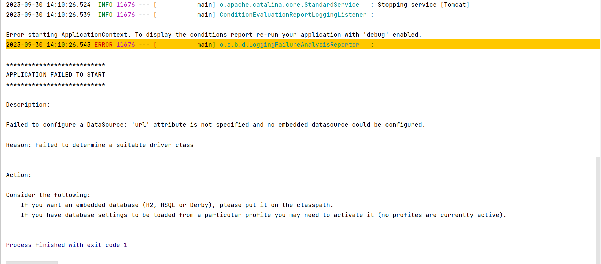
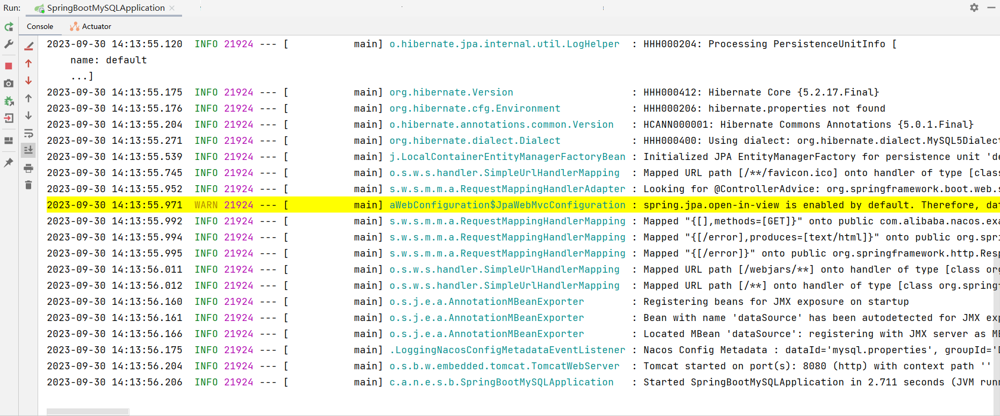

# 2.3Nacos集成SpringBoot

SpringBoot相当于是Spring的升级版，集成了各种的自动配置，同时内嵌了tomcat容器，这样的话也方便了部署和测试，相较于上一章冗余的配置，这一章会更加的简介。

## 2.3.1 SpringBoot属性配置

因为对于SpringBoot来说，一些基本的配置已经被配置好了，我们只需要去更新必要的配置，如nacos的服务地址。然后直接使用即可，使用的方法也和Spring差不多。这个项目是nacos-spring-boot-config-example

首先我们来看一下application.properties这个文件：

```properties
# 修改nacos的配置的地址
nacos.config.server-addr=192.168.150.101:8848
# 下面是Spring应用的健康审查
# endpoint http://localhost:8080/actuator/nacos-config
# health http://localhost:8080/actuator/health
management.endpoints.web.exposure.include=*
management.endpoint.health.show-details=always
```

然后我们来看下控制层基本上就可以了，可以发现controller和之前的Spring的配置无太大的差别。

```java
@Controller
@RequestMapping("config")
public class ConfigController {

    @NacosValue(value = "${useLocalCache:false}", autoRefreshed = true)
    private boolean useLocalCache;

    @RequestMapping(value = "/get", method = GET)
    @ResponseBody
    public boolean get() {
        return useLocalCache;
    }
}
```

然后是启动类,基本上无太大的差别

```java
@SpringBootApplication
@NacosPropertySource(dataId = "example", autoRefreshed = true)
public class NacosConfigApplication {

    public static void main(String[] args) {
        SpringApplication.run(NacosConfigApplication.class, args);
    }
}
```


当我们修改值后再进行访问就会得到我们修改的值


## 2.3.2 SpringBoot集成配置数据库

这一小节对应的实例是nacos-spring-boot-config-mysql-example这个小项目。最主要的是在启动类添加了@NacosPropertySource(dataId = "mysql.properties")这个注解，然后就会从nacos中拉取对应的文件内容。

```java
@SpringBootApplication
@NacosPropertySource(dataId = "mysql.properties")
public class SpringBootMySQLApplication {

    public static void main(String[] args) {
        SpringApplication.run(SpringBootMySQLApplication.class, args);
    }
}
```

我们需要先在nacos中创建mysql.properties的配置文件，然后才能启动应用，不然会报错。



mysql.properties

```properties
spring.datasource.url=jdbc:mysql://localhost:3306/user?useUnicode=true&characterEncoding=utf8&useSSL=false&serverTimezone=UTC
spring.datasource.username=root
spring.datasource.password=123456
spring.datasource.initial-size=10
spring.datasource.max-active=20
```



通过http请求查询后可以获取到对应的值


## 2.3.3 SpringBoot 服务发现

对应于Spring的升级版，这里和前几节差不多，我们首先需要修改的就是配置文件的服务器的地址

```properties
nacos.discovery.server-addr=192.168.150.101:8848
```

然后通过控制层去查看所有的服务信息，从而完成服务发现的步骤

```java
@Controller
@RequestMapping("discovery")
public class DiscoveryController {

    @NacosInjected
    private NamingService namingService;

    @RequestMapping(value = "/get", method = GET)
    @ResponseBody
    public List<Instance> get(@RequestParam String serviceName) throws NacosException {
        return namingService.getAllInstances(serviceName);
    }
}
```

通过NamingService查询所有的服务的实例，我们来进行启动查询。


这里依旧是获取不到信息，可能是因为版本的原因。

## 2.3.4 总结

总的来说，相较于Spring，SpringBoot有了很多的优化，既不用我们再去配置web容器，也用我们去书写繁杂的xml注解，方便了我们的开发工作，是的开发变得更加的方便，更加的易用起来了。

对于Spring和SpringBoot都有一点就是服务发现时发现不了，但是对应版本的client实现却能找到，应该是版本的影响。


