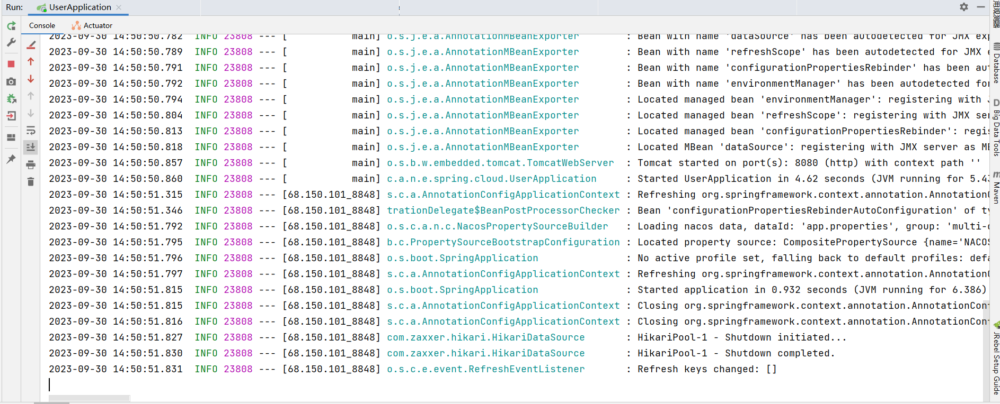

上一章我们学习了集成SpringBoot，其实和对应的Spring没有太多的变化，基本上还是配置和服务发现。

下面我们将来了解一下SpringCloud，对于单体应用可能不满足大型的互联网架构，因此越来越多的应用转换到了微服务，对应的有SpringCloud 和SpringCloud Alibaba ，我们主要针对的是第二个，因为nacos本身也是阿里生态里的组件，我们将探讨nacos在SpringCloud中的使用。

# 2.4 Nacos集成SpringCloud

首先便是依赖文件发生变化，变化为alibaba下面的组件依赖。

```xml
        <dependency>
            <groupId>org.springframework.cloud</groupId>
            <artifactId>spring-cloud-starter-alibaba-nacos-config</artifactId>
            <version>0.2.1.RELEASE</version>
        </dependency>
```

其次便是配置文件的变化，之前是application.properties，现在是微服务，所以变成了bootstrap.properties，

## 2.4.1 Nacos配置SpringCloud

这个小项目是nacos-spring-cloud-config-example,我们需要配置一下几项。

```properties
# nacos的服务地址
spring.cloud.nacos.config.server-addr=192.168.150.101:8848

# 应用名
spring.application.name=example
# Config Type: properties(Default Value) \ yaml \ yml
# 配置文件的拓展名
spring.cloud.nacos.config.file-extension=properties
#spring.cloud.nacos.config.file-extension=yaml

# Map Nacos Config: example.properties

# Create the config Of nacos firstly?you can use one of the following two methods:
## Create Config By OpenAPI
### Create Config By OpenAPI
# curl -X POST 'http://127.0.0.1:8848/nacos/v1/cs/configs' -d 'dataId=example.properties&group=DEFAULT_GROUP&content=useLocalCache=true'
### Get Config By OpenAPI
# curl -X GET 'http://127.0.0.1:8848/nacos/v1/cs/configs?dataId=example.properties&group=DEFAULT_GROUP'

## Create Config By Console
### Login the console of Nacos: http://127.0.0.1:8848/nacos/index.html , then create config:
### Data ID: example.properties
### Group: DEFAULT_GROUP
### Content: useLocalCache=true
```

Controller

```java
@RestController
@RequestMapping("/config")
// 配置这个类中的属性是可以进行自动刷新的
@RefreshScope
public class ConfigController {

    @Value("${useLocalCache:false}")
    private boolean useLocalCache;

    /**
     * http://localhost:8080/config/get
     */
    @RequestMapping("/get")
    public boolean get() {
        return useLocalCache;
    }
}
```


然后我们按照提示创建配置(这里我们已经在前面几节创建过了)，然后我们启动观察，是否可以实现。


然后我们再去修改，再次进行查询


主要是spring.application.name=example和spring.cloud.nacos.config.file-extension=properties通过两个配置项从而锁定配置文件。

## 2.4.2 Nacos配置多个数据源

nacos-spring-cloud-config-multi-data-ids-example

从Spring那里我们大概了解到了，nacos可以同时注册多个数据，那么对于SpringCloud来说肯定也是需要这个需求的，那么我们接下来将进一步的学习怎么来使用。

bootstrap.properties文件

```properties
spring.application.name=multi-data-ids-example

spring.cloud.nacos.config.server-addr=192.168.150.101:8848

spring.cloud.nacos.config.ext-config[0].data-id=app.properties
spring.cloud.nacos.config.ext-config[0].group=multi-data-ids
spring.cloud.nacos.config.ext-config[0].refresh=true

spring.cloud.nacos.config.ext-config[1].data-id=datasource.properties
spring.cloud.nacos.config.ext-config[1].group=multi-data-ids

spring.cloud.nacos.config.ext-config[2].data-id=redis.properties
spring.cloud.nacos.config.ext-config[2].group=multi-data-ids
```

采用了如上的配置方法，之后我们也可以按照它这个来进行拓展书写，因为我们之前已经配置过了，所以在这里我们就直接进行启动。



启动成功，首先我们不开启redis缓存，来进行查询。


查询到了对应的值，此时的app.user.cache=false，是没有开启缓存的，所以缓存没数据，然后我们来开启缓存。

```java
@Service
@RefreshScope
public class UserServiceImpl implements UserService {

    private static final Logger LOGGER = LoggerFactory.getLogger(UserServiceImpl.class);

    private final UserRepository userRepository;

    private final RedisTemplate redisTemplate;

    @Value("${app.user.cache}")
    private boolean cache;

    @Autowired
    public UserServiceImpl(UserRepository userRepository, RedisTemplate redisTemplate) {
        this.userRepository = userRepository;
        this.redisTemplate = redisTemplate;
    }

    @Override
    public User findById(Long id) {
        LOGGER.info("cache: {}", cache);

        if (cache) {
            Object obj = redisTemplate.opsForValue().get(key(id));
            if (obj != null) {
                LOGGER.info("get user from cache, id: {}", id);
                return (User)obj;
            }
        }

        User user = userRepository.findById(id).orElse(null);
        if (user != null) {
            if (cache) {
                LOGGER.info("set cache for user, id: {}", id);
                redisTemplate.opsForValue().set(key(id), user);
            }
        }

        return user;
    }

    private String key(Long id) {
        return String.format("nacos-spring-cloud-config-multi-data-ids-example:user:%d", id);
    }

}
```

可以看到缓存的值已经有了。


## 2.4.3 nacos服务发现

nacos-spring-cloud-discovery-example,里面有两个小的子项目，分别扮演者生产者和消费者的例子。

我们首先来看consumer

```xml
        <dependency>
            <groupId>org.springframework.cloud</groupId>
            <artifactId>spring-cloud-starter-alibaba-nacos-discovery</artifactId>
            <exclusions>
                <exclusion>
                    <groupId>com.alibaba.nacos</groupId>
                    <artifactId>nacos-client</artifactId>
                </exclusion>
            </exclusions>
        </dependency>
        <dependency>
            <groupId>com.alibaba.nacos</groupId>
            <artifactId>nacos-client</artifactId>
        </dependency>
    </dependencies>
```

配置文件application.properties

```properties
server.port=8080
spring.application.name=service-consumer
spring.cloud.nacos.discovery.server-addr=192.168.150.101:8848
```

然后就是比较主要的类了

```java
@SpringBootApplication
// 开启服务发现的客户端
@EnableDiscoveryClient
public class NacosConsumerApplication {
	// 负载均衡
    @LoadBalanced
    @Bean
    public RestTemplate restTemplate() {
        return new RestTemplate();
    }

    public static void main(String[] args) {
        SpringApplication.run(NacosConsumerApplication.class, args);
    }
	// 测试的控制类
    @RestController
    public class TestController {

        private final RestTemplate restTemplate;

        @Autowired
        public TestController(RestTemplate restTemplate) {this.restTemplate = restTemplate;}
		
        @RequestMapping(value = "/echo/{str}", method = RequestMethod.GET)
        public String echo(@PathVariable String str) {
            return restTemplate.getForObject("http://service-provider/echo/" + str, String.class);
        }
    }
}
```

生产者

```properties
server.port=8070
spring.application.name=service-provider
spring.cloud.nacos.discovery.server-addr=192.168.150.101:8848
```

```java
@SpringBootApplication
// 开启服务发现客户端
@EnableDiscoveryClient
public class NacosProviderApplication {

   public static void main(String[] args) {
      SpringApplication.run(NacosProviderApplication.class, args);
   }
	// 调用的服务
   @RestController
   class EchoController {
      @RequestMapping(value = "/echo/{string}", method = RequestMethod.GET)
      public String echo(@PathVariable String string) {
         return "Hello Nacos Discovery " + string;
      }
   }
}
```

```xml
        <dependency>
            <groupId>org.springframework.cloud</groupId>
            <artifactId>spring-cloud-starter-alibaba-nacos-discovery</artifactId>
            <exclusions>
                <exclusion>
                    <groupId>com.alibaba.nacos</groupId>
                    <artifactId>nacos-client</artifactId>
                </exclusion>
            </exclusions>
        </dependency>
        <dependency>
            <groupId>com.alibaba.nacos</groupId>
            <artifactId>nacos-client</artifactId>
        </dependency>
```

然后我们来启动生产者和消费者，然后看看服务发现是否能够生效。


确实调用了对应的服务，并把结果给返回了，然后我们来看一下nacos的控制台。


在这里有一个小的特性便是动态的dns，这里究竟是怎么实现的呢，我们之后的源码解析时会提到，这里我们只是简单的知道有这个很高级的功能即可。

我们对于SpringCloud的使用就基本上告一段落了。

