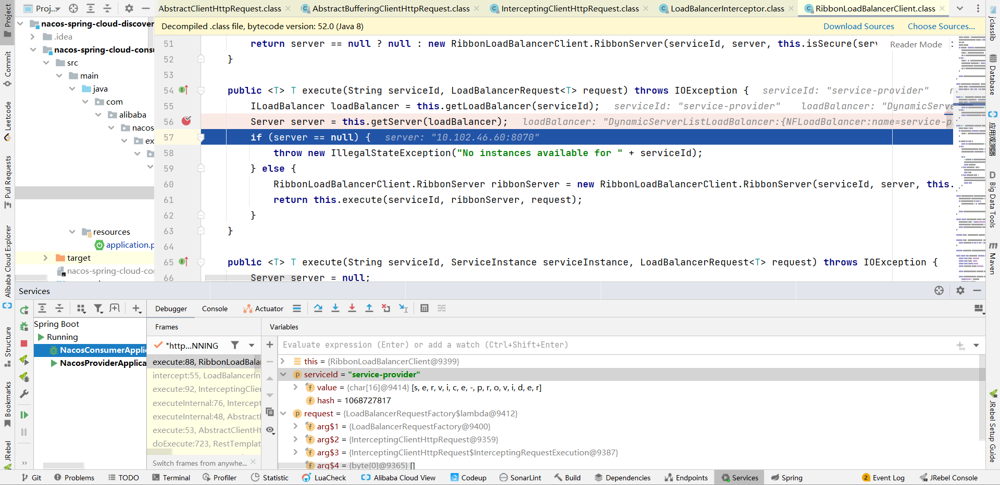
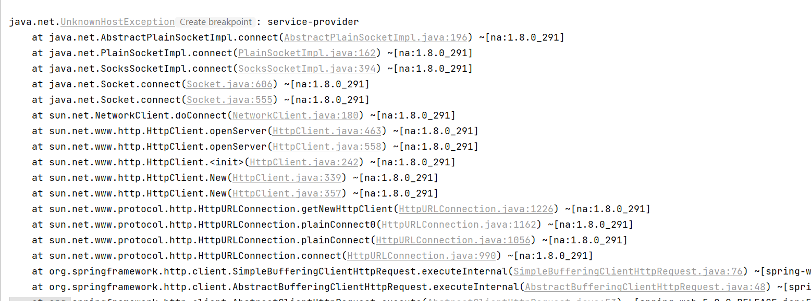
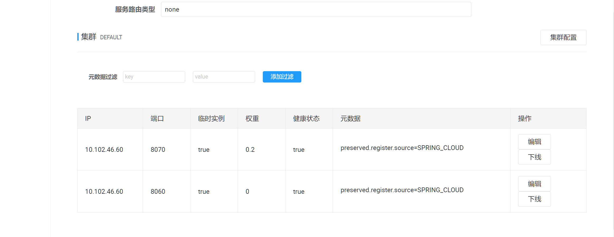

之前我们已经对于nacos的使用已经有了一定的了解，接下来我们将对于一些核心的特性来进行学习，首先便是它的动态DNS实现

# 3.1 核心特性

## 3.1.1 DNS服务

我们以SpringCloud的请求为例，来看一下这个DNS是如何实现的，首先我们来看一下这段代码

```java
        @RequestMapping(value = "/echo/{str}", method = RequestMethod.GET)
        public String echo(@PathVariable String str) {
            return restTemplate.getForObject("http://service-provider/echo/" + str, String.class);
        }
```

理论上来说，这段代码使用了service-provider这个域名，应该去请求这个域名对应的服务器，那么下来是怎么做的呢，通过debug我们发现，它首先将域名当作服务名取出，然后通过ribbon的负载均衡取出了这个服务名对应的服务器地址。



那么此时我有个猜想就是，**如果没有了负载均衡，他还会具有动态路由的特性吗？**我们将负载均衡去掉试一下。



出现了报错，未知域名的错误，这里大概就可以猜出来了，它通过负载均衡在rest请求的时候将对应的服务名更改为对应的ip地址进而在请求的时候去请求对应的服务器。

接下来我们来继续看一下，那么nacos是什么时候和负载均衡关联到一起的呢？

我们通过debug，我们发现了最后是**LoadBlancer**把服务Id封装成了**ILoadBalancer**,然后通过Spring的对象工厂通过名称和类型的方式找到已经装配的对象

```java
    public <T> T getInstance(String name, Class<T> type) {
        AnnotationConfigApplicationContext context = this.getContext(name);
        return BeanFactoryUtils.beanNamesForTypeIncludingAncestors(context, type).length > 0 ? context.getBean(type) : null;
    }
```

当取到对应的ILoadBalancer对象后，通过它得到了对应的Server，然后Server中则是包含了元数据信息,如果没有找到对应的服务的话，那么就按照原始的域名进行访问。

```java
    protected Server getServer(ILoadBalancer loadBalancer) {
        return loadBalancer == null ? null : loadBalancer.chooseServer("default");
    }
```

现在呢就找到了最主要的类自动装配的类RibbonNacosAutoConfiguration

```java
@Configuration
@EnableConfigurationProperties
@ConditionalOnBean({SpringClientFactory.class})
@ConditionalOnRibbonNacos
@ConditionalOnNacosDiscoveryEnabled
@AutoConfigureAfter({RibbonAutoConfiguration.class})
@RibbonClients(
    defaultConfiguration = {NacosRibbonClientConfiguration.class}
)
public class RibbonNacosAutoConfiguration {
    public RibbonNacosAutoConfiguration() {
    }
}
```

提到了自动装配就不得不提一下SpringBoot的自动装配，在springboot的自动装配过程中，最终会加载`META-INF/spring.factories`文件，而加载的过程是由`SpringFactoriesLoader`加载的。从CLASSPATH下的每个Jar包中搜寻所有`META-INF/spring.factories`配置文件，然后将解析properties文件，找到指定名称的配置后返回。需要注意的是，其实这里不仅仅是会去ClassPath路径下查找，会扫描所有路径下的Jar包，只不过这个文件只会在Classpath下的jar包中。

我们来看一下nacos的自动装配的factories文件

```
org.springframework.boot.autoconfigure.EnableAutoConfiguration=\
  org.springframework.cloud.alibaba.nacos.NacosDiscoveryAutoConfiguration,\
  org.springframework.cloud.alibaba.nacos.ribbon.RibbonNacosAutoConfiguration,\
  org.springframework.cloud.alibaba.nacos.endpoint.NacosDiscoveryEndpointAutoConfiguration,\
  org.springframework.cloud.alibaba.nacos.discovery.NacosDiscoveryClientAutoConfiguration
```

总共是四个NacosDiscoveryAutoConfiguration、RibbonNacosAutoConfiguration、NacosDiscoveryEndpointAutoConfiguration、NacosDiscoveryClientAutoConfiguration

我们从第一个看起**NacosDiscoveryAutoConfiguration**

```java
// 声明为配置类
@Configuration
// 使得使用@ConfigurationProperties的类生效
@EnableConfigurationProperties
// nacos的服务发现是开启的
@ConditionalOnNacosDiscoveryEnabled
// 是否开启了这个属性，如果没有配置就是默认开启的
@ConditionalOnProperty(
    value = {"spring.cloud.service-registry.auto-registration.enabled"},
    matchIfMissing = true
)
// 在类之后进行自动配置，为什么要在这两个类之后进行装配呢， 因为要按照使用的自己配置的优先，如果存在这两个类就说明需要进行自动装配。
@AutoConfigureAfter({AutoServiceRegistrationConfiguration.class, AutoServiceRegistrationAutoConfiguration.class})
public class NacosDiscoveryAutoConfiguration {
    public NacosDiscoveryAutoConfiguration() {
    }
	
    // NacosServiceRegistry 服务的Bean, 用于注册NacosRegistration。
    @Bean
    public NacosServiceRegistry nacosServiceRegistry(NacosDiscoveryProperties nacosDiscoveryProperties) {
        return new NacosServiceRegistry(nacosDiscoveryProperties);
    }
	
    //  封装的NacosRegistration
    @Bean
    @ConditionalOnBean({AutoServiceRegistrationProperties.class})
    public NacosRegistration nacosRegistration(NacosDiscoveryProperties nacosDiscoveryProperties, ApplicationContext context) {
        return new NacosRegistration(nacosDiscoveryProperties, context);
    }
	// 自动装配的NacosAutoServiceRegistration
    @Bean
    @ConditionalOnBean({AutoServiceRegistrationProperties.class})
    public NacosAutoServiceRegistration nacosAutoServiceRegistration(NacosServiceRegistry registry, AutoServiceRegistrationProperties autoServiceRegistrationProperties, NacosRegistration registration) {
        return new NacosAutoServiceRegistration(registry, autoServiceRegistrationProperties, registration);
    }
}
```

RibbonNacosAutoConfiguration 用于集成Ribbon实现负载均衡

```java
// 声明为配置类
@Configuration
// @EnableConfigurationProperties注解应用到你的@Configuration时， 任何被@ConfigurationProperties注解的beans将自动被Environment属性配置。
@EnableConfigurationProperties
// 有这个类
@ConditionalOnBean({SpringClientFactory.class})
// 
@ConditionalOnRibbonNacos
// 是否开启服务发现
@ConditionalOnNacosDiscoveryEnabled
// 在Ribbion配置以后再进行自动装配
@AutoConfigureAfter({RibbonAutoConfiguration.class})
// 设置客户端的配置类
@RibbonClients(
    defaultConfiguration = {NacosRibbonClientConfiguration.class}
)
public class RibbonNacosAutoConfiguration {
    public RibbonNacosAutoConfiguration() {
    }
}
```


在ribbion的配置类中将nacos的服务进行初始化到ServerList。

```java
    @Configuration
    @ConditionalOnClass({HttpRequest.class})
    @RibbonAutoConfiguration.ConditionalOnRibbonRestClient
    protected static class RibbonClientHttpRequestFactoryConfiguration {
        @Autowired
        private SpringClientFactory springClientFactory;

        protected RibbonClientHttpRequestFactoryConfiguration() {
        }

        @Bean
        public RestTemplateCustomizer restTemplateCustomizer(final RibbonClientHttpRequestFactory ribbonClientHttpRequestFactory) {
            return (restTemplate) -> {
                restTemplate.setRequestFactory(ribbonClientHttpRequestFactory);
            };
        }

        @Bean
        public RibbonClientHttpRequestFactory ribbonClientHttpRequestFactory() {
            return new RibbonClientHttpRequestFactory(this.springClientFactory);
        }
    }
```

在RibbonClientHttpRequestFactoryConfiguration这个类中可以看到，ribbion的http请求工厂使用了SpringClientFactory，然后所有的rest请求就交予了它，所以便会有了之后的请求拦截，然后实现DNS将域名兑换为相应的IP地址，然后在通过重组的ip地址进行请求，并返回响应。

NacosDiscoveryEndpointAutoConfiguration，用于 nacos 发现、获取 nacos 属性和订阅服务的端点

```java
@Configuration
@ConditionalOnClass({Endpoint.class})
@ConditionalOnNacosDiscoveryEnabled
public class NacosDiscoveryEndpointAutoConfiguration {
    public NacosDiscoveryEndpointAutoConfiguration() {
    }

    @Bean
    @ConditionalOnMissingBean
    @ConditionalOnEnabledEndpoint
    public NacosDiscoveryEndpoint nacosDiscoveryEndpoint(NacosDiscoveryProperties nacosDiscoveryProperties) {
        return new NacosDiscoveryEndpoint(nacosDiscoveryProperties);
    }
}
```

NacosDiscoveryClientAutoConfiguration  服务发现客户端自动配置

```java
@Configuration
// 开了服务发现
@ConditionalOnNacosDiscoveryEnabled
// 在这两个类之前进行装配
@AutoConfigureBefore({SimpleDiscoveryClientAutoConfiguration.class, CommonsClientAutoConfiguration.class})
public class NacosDiscoveryClientAutoConfiguration {
    public NacosDiscoveryClientAutoConfiguration() {
    }
	
    // 这个类用于描述当前注册服务的元数据信息
    @Bean
    @ConditionalOnMissingBean
    public NacosDiscoveryProperties nacosProperties() {
        return new NacosDiscoveryProperties();
    }
	
    // 服务发现客户端，用于获取nacos的服务的信息
    @Bean
    public DiscoveryClient nacosDiscoveryClient(NacosDiscoveryProperties discoveryProperties) {
        return new NacosDiscoveryClient(discoveryProperties);
    }
	
    // 注册配置监听器到Spring
    @Bean
    // 没有Nacoswach这个类
    @ConditionalOnMissingBean
    // 是否开启
    @ConditionalOnProperty(
        value = {"spring.cloud.nacos.discovery.watch.enabled"},
        matchIfMissing = true
    )
    public NacosWatch nacosWatch(NacosDiscoveryProperties nacosDiscoveryProperties) {
        return new NacosWatch(nacosDiscoveryProperties);
    }
}
```

那么动态DNS就看到这里。

## 3.1.2 服务发现

下面我们来看一下它的服务发现是如何实现的，服务发现是nacos的一项重要的功能，主要有几点，

**第一点是服务发现是如何实现的？**

在上一节我们发现有一个监听类就是NacosWatch，SpringCloud应用正是通过NacosWatch去nacos服务端去拉取对应的服务的实例列表，而对于自己依赖的服务也是在第一期调用服务接口的时候去服务端去加载，是一种懒加载机制。

当我们第一次启动时，我们去访问服务，此时容器内还没有已注入到Spring容器中的负载均衡对象


通过双重检查创建了一个对应的对象，然后返回和它相关的上下文对象，然后就有了这个存在的对象，那我们可以大概的判断对应的对象创建是在this.createContext()方法，我们接下来继续来看这个方法。

可以看到是创建了一个新的上下文对象


大概是在这里来查看工厂是否已经有了对应的服务的名称和对应的类，如果没有的话就是重新的创建一个**ZoneAwareLoadBalancer**，很明显，第一次的话就是新建一个这个类，然后缓存到内存中，供之后的使用。

DynamicServerListLoadBalancer是这么介绍的：

**能够使用动态源获取服务器候选列表的负载平衡器。即服务器列表可能会在运行时更改。它还包含可以通过过滤器条件传递服务器列表以过滤出不符合所需条件的服务器的工具。**

即就是在这里进行动态的获取对应的服务的信息资源的，

```java
    void restOfInit(IClientConfig clientConfig) {
        boolean primeConnection = this.isEnablePrimingConnections();
        // turn this off to avoid duplicated asynchronous priming done in BaseLoadBalancer.setServerList()
        this.setEnablePrimingConnections(false);
        enableAndInitLearnNewServersFeature();
		
        // 通过这个方法来进行更新服务 
        updateListOfServers();
        if (primeConnection && this.getPrimeConnections() != null) {
            this.getPrimeConnections()
                    .primeConnections(getReachableServers());
        }
        this.setEnablePrimingConnections(primeConnection);
        LOGGER.info("DynamicServerListLoadBalancer for client {} initialized: {}", clientConfig.getClientName(), this.toString());
    }
```

然后再到nacos的ribbion中的NacosServerList，来获取服务的元数据信息，至此，元数据信息就被获取到了，那么此时就可以判断，在第一次请求服务的时候才会进行加载，中间也进行了单例的处理。

**第二点新服务出现的话是如何处理的？**

这就相当于上面的一样，在第一次服务请求时才会进行动态的进行查询服务器的信息，然后进行获取服务器上注册的信息。

**第三点如何维护程序和nacos服务器的心跳？**

心跳的话维护的是服务和nacos服务器之间的连接，那么我们就要去找NacosClient中的一些类来进行探讨，一般的话都有见名知义的命名，我们去找到client包下的beat包，然后我们来单独摘出来进行查看

BeatInfo心跳信息

```java
public class BeatInfo {
    // 端口
    private int port;
    // ip
    private String ip;
    // 权重
    private double weight;
    // 服务名
    private String serviceName;
    // 集群名
    private String cluster;
    // 元数据信息
    private Map<String, String> metadata;
    // 是否定时
    private volatile boolean scheduled;
    // 多久来进行维护心跳
    private volatile long period;
    // 是否停止
    private volatile boolean stopped;
}

```

BeatReactor 心跳响应器

```java
public class BeatReactor {
    private ScheduledExecutorService executorService;
    // 代理
    private NamingProxy serverProxy;
    public final Map<String, BeatInfo> dom2Beat;

    public BeatReactor(NamingProxy serverProxy) {
        this(serverProxy, UtilAndComs.DEFAULT_CLIENT_BEAT_THREAD_COUNT);
    }

    public BeatReactor(NamingProxy serverProxy, int threadCount) {
        this.dom2Beat = new ConcurrentHashMap();
        this.serverProxy = serverProxy;
        // 线程池,演示任务
        this.executorService = new ScheduledThreadPoolExecutor(threadCount, new ThreadFactory() {
            public Thread newThread(Runnable r) {
                Thread thread = new Thread(r);
                thread.setDaemon(true);
                thread.setName("com.alibaba.nacos.naming.beat.sender");
                return thread;
            }
        });
    }
	// 添加心跳信息
    public void addBeatInfo(String serviceName, BeatInfo beatInfo) {
        LogUtils.NAMING_LOGGER.info("[BEAT] adding beat: {} to beat map.", beatInfo);
        this.dom2Beat.put(this.buildKey(serviceName, beatInfo.getIp(), beatInfo.getPort()), beatInfo);
        // 单独开一个线程执行心跳
        this.executorService.schedule(new BeatReactor.BeatTask(beatInfo), 0L, TimeUnit.MILLISECONDS);
        MetricsMonitor.getDom2BeatSizeMonitor().set((double)this.dom2Beat.size());
    }
	
    // 移出心跳信息
    public void removeBeatInfo(String serviceName, String ip, int port) {
        LogUtils.NAMING_LOGGER.info("[BEAT] removing beat: {}:{}:{} from beat map.", new Object[]{serviceName, ip, port});
        BeatInfo beatInfo = (BeatInfo)this.dom2Beat.remove(this.buildKey(serviceName, ip, port));
        if (beatInfo != null) {
            beatInfo.setStopped(true);
            MetricsMonitor.getDom2BeatSizeMonitor().set((double)this.dom2Beat.size());
        }
    }
	// 构建Key
    private String buildKey(String serviceName, String ip, int port) {
        return serviceName + "#" + ip + "#" + port;
    }
	
    // 线程池任务，用于发送心跳信息
    class BeatTask implements Runnable {
        BeatInfo beatInfo;

        public BeatTask(BeatInfo beatInfo) {
            this.beatInfo = beatInfo;
        }

        public void run() {
            // 是否停止
            if (!this.beatInfo.isStopped()) {
               	// 结果
                long result = BeatReactor.this.serverProxy.sendBeat(this.beatInfo);
                // 下次时间
                long nextTime = result > 0L ? result : this.beatInfo.getPeriod();
                // 新的心跳
                BeatReactor.this.executorService.schedule(BeatReactor.this.new BeatTask(this.beatInfo), nextTime, TimeUnit.MILLISECONDS);
            }
        }
    }
}

```

## 3.1.3 权重管理

我们可以在拥有多台服务器的服务启动权重管理，通过指定的权重来限制客户端访问时的概率。



那么限制权重又是怎么处理的呢，我们继续来查看源码。

首先，我们先来查看修改权重的接口，然后我们通过接口来查看究竟走向了哪一步。


在源码中，我们找到了InstanceController这个文件，从中找到了一段更改权重的代码。

```java
    @CanDistro
    @PutMapping
    @Secured(action = ActionTypes.WRITE)
    public String update(HttpServletRequest request) throws Exception {
        String namespaceId = WebUtils.optional(request, CommonParams.NAMESPACE_ID, Constants.DEFAULT_NAMESPACE_ID);
        String serviceName = WebUtils.required(request, CommonParams.SERVICE_NAME);
        NamingUtils.checkServiceNameFormat(serviceName);
        // 实例
        Instance instance = HttpRequestInstanceBuilder.newBuilder()
                .setDefaultInstanceEphemeral(switchDomain.isDefaultInstanceEphemeral()).setRequest(request).build();
        // 更新实例
        getInstanceOperator().updateInstance(namespaceId, serviceName, instance);
        return "ok";
    }
```

然后就是写入存储

## 3.1.4 打标管理


## 3.1.5 优雅上下线


## 3.1.6 在线编辑


## 3.1.7 历史版本


## 3.1.8 一键回滚


## 3.1.9 灰度发布


## 3.1.10 推送轨迹